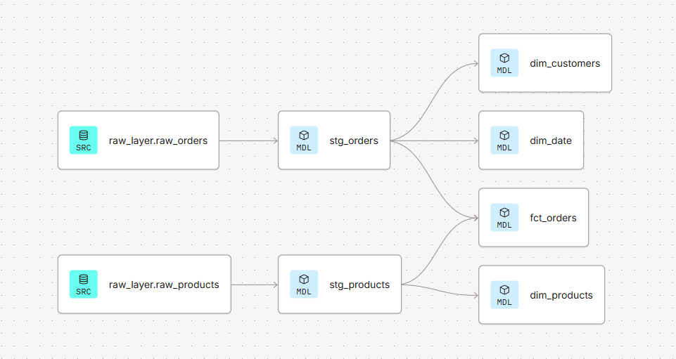
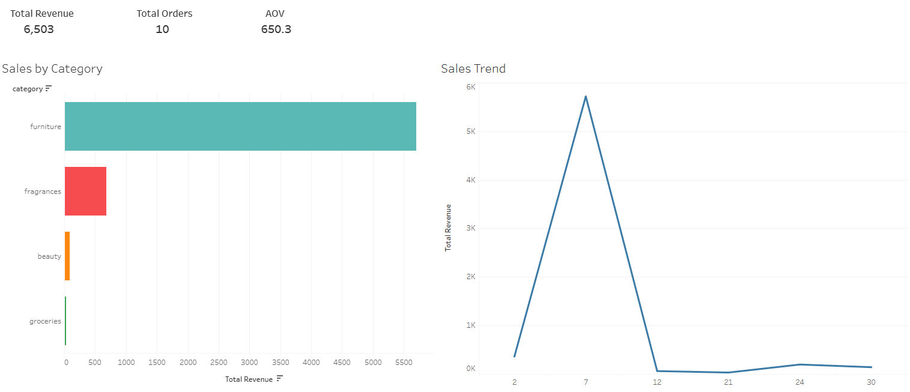

## Data Warehouse Star Schema:


## Tableau Dashboard:


To execute scripts/ingest_data.py, save your GCP Service Account credentials as key.json in the root directory and configure the environment variables.
### Environment Configuration

Create a `.env` file in the root directory (or set environment variables):

```env
GCP_PROJECT_ID=your-gcp-project-id
GOOGLE_APPLICATION_CREDENTIALS=key.json
```

### Resources:
- Learn more about dbt [in the docs](https://docs.getdbt.com/docs/introduction)
- Check out [Discourse](https://discourse.getdbt.com/) for commonly asked questions and answers
- Join the [dbt community](https://getdbt.com/community) to learn from other analytics engineers
- Find [dbt events](https://events.getdbt.com) near you
- Check out [the blog](https://blog.getdbt.com/) for the latest news on dbt's development and best practices
